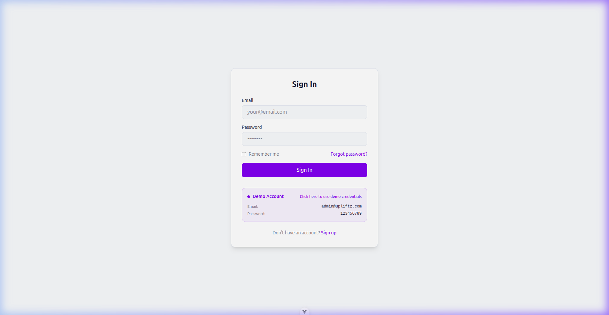
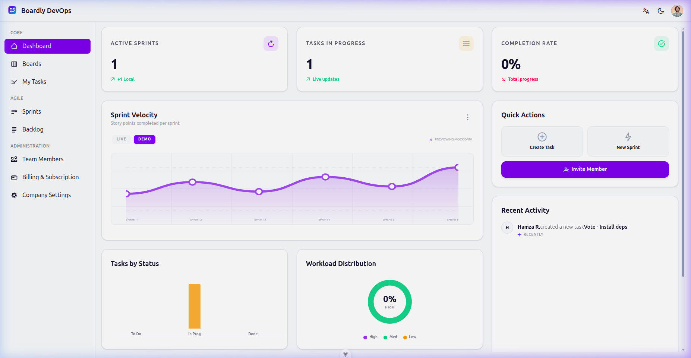

# Boardly

Boardly is a modern, premium project management and Kanban board application. This repository contains the source code for both the backend API and the frontend web application, orchestrated with Docker.

## 🚀 Live Demo

Experience Boardly live: **[boardly-devops.vercel.app](https://boardly-devops.vercel.app)**

### Demo Credentials
- **Email**: `demo@upliftz.com`
- **Password**: `Boardly!4wjs3rtlA1`

---

<p align="center">
  
  
</p>

---

## Project Structure

The project is divided into two main components:

- **[boardly-api](./boardly-api)**: The backend service built with [NestJS](https://nestjs.com/). It handles data persistence, authentication, and core business logic.
- **[boardly-web](./boardly-web)**: The frontend application built with [Vue 3](https://vuejs.org/) and [Vite](https://vitejs.dev/). It provides a responsive and dynamic user interface.

## Tech Stack

- **Backend**: Node.js, NestJS, TypeScript
- **Frontend**: Vue 3, Vite, TailwindCSS, TypeScript
- **Infrastructure**: Docker, Docker Compose

## Getting Started

### Prerequisites

- [Node.js](https://nodejs.org/) (v18 or later recommended)
- [Docker](https://www.docker.com/) and [Docker Compose](https://docs.docker.com/compose/)

### Quick Start with Docker

The easiest way to get the entire system up and running is using Docker Compose:

1.  **Clone the repository**:
    ```bash
    git clone <repository-url>
    cd boardly-devops
    ```

2.  **Start the services**:
    ```bash
    docker-compose up --build
    ```

The services will be available at:
- **API**: [http://localhost:3000](http://localhost:3000)
- **Web**: [http://localhost:8080](http://localhost:8080)

## Development

For detailed instructions on setting up and developing each service individually, please refer to their respective README files:

- [Backend API Development](./boardly-api/README.md)
- [Frontend Web Development](./boardly-web/README.md)

## Show Your Support

We’d love to hear your thoughts on Boardly! How are you using it? What features do you find most useful?

If you find this project helpful or enjoy using it, please consider giving it a ⭐️ on GitHub. Your support helps the project grow!

## License

This project is [MIT licensed](./LICENSE).
